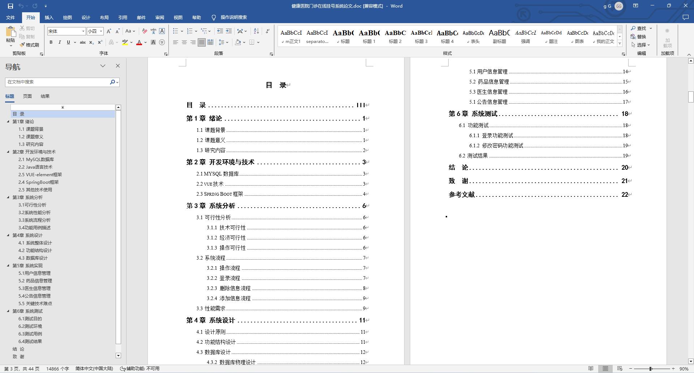
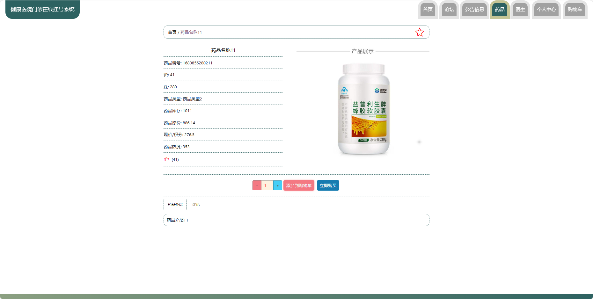
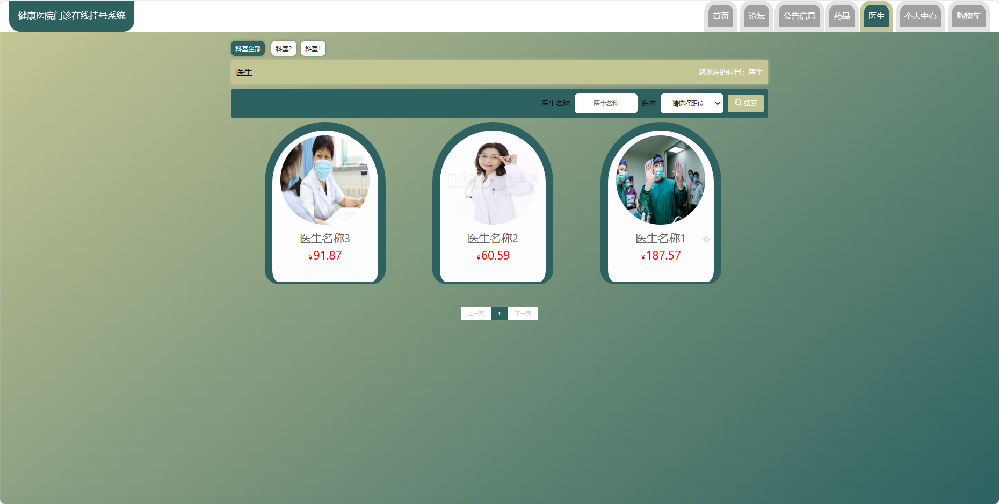
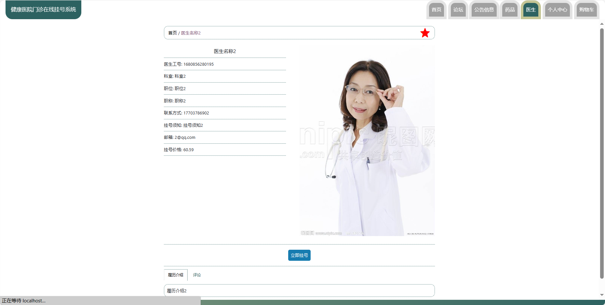

基于Springboot的健康医院门诊在线挂号系统（程序+论文）
=
### 完整代码获取地址：从戎源码网 ([https://armycodes.com/](https://armycodes.com/))
### 作者微信：19941326836  QQ：952045282 
### 承接计算机毕业设计、Java毕业设计、Python毕业设计、深度学习、机器学习
### 选题+开题报告+任务书+程序定制+安装调试+论文+答辩ppt 一条龙服务
### 所有选题地址https://github.com/nature924/allProject

一、项目介绍
---
基于Spring Boot框架实现的健康医院门诊在线挂号系统，系统包含三种角色：管理员、用户,医生主要功能如下。

### 【用户功能】

1. **首页：** 浏览医院的相关信息和。
2. **论坛：** 参与医疗讨论，与其他用户分享经验。
3. **公告信息：** 获取医院发布的通知和公告。
4. **药品：** 浏览医院提供的药品信息。
5. **医生：** 查看医生的排班和相关信息。
6. **个人中心：** 管理个人信息。
7. **购物车：** 将需要购买的药品加入购物车。

### 【管理员功能】

1. **首页：** 查看整体系统。
2. **个人中心：** 修改密码和管理个人信息。
3. **管理员管理：** 管理系统中的管理员账号。
4. **用户管理：** 管理用户的账号信息，包括审核注册。
5. **医生管理：** 管理医生的信息，包括添加、编辑和删除。
6. **挂号管理：** 查看和管理用户的挂号记录。
7. **药品管理：** 管理医院提供的药品，包括添加、编辑和删除。
8. **基础数据管理：** 管理系统的基础数据，包括公告类型、药品类型、科室、职位等。
9. **论坛管理：** 管理医疗讨论论坛的帖子和评论。
10. **公告信息管理：** 发布和管理医院的公告信息。
11. **轮播图信息：** 管理系统首页的轮播图。

### 【医生功能】

1. **首页：** 查看医院信息。
2. **个人中心：** 修改密码和管理个人信息。
3. **医生管理：** 查看自己的评价和收藏情况。
4. **挂号管理：** 查看和管理挂在自己名下的患者。
5. **药品管理：** 查看和管理开给患者的药品信息。
6. **论坛管理：** 参与医疗讨论，回答患者的问题。
7. **公告信息管理：** 获取医院发布的通知和公告。

二、项目技术
---
- 编程语言：Java
- 数据库：MySQL
- 项目管理工具：Maven
- 前端技术：VUE、HTML、Jquery、Bootstrap
- 后端技术：Spring、SpringMVC、MyBatis

三、运行环境
---
- 操作系统：Windows、macOS都可以
- JDK版本：JDK1.8以上都可以
- 开发工具：IDEA、Ecplise、Myecplise都可以
- 数据库: MySQL5.7以上都可以
- Tomcat：任意版本都可以
- Maven：任意版本都可以

四、运行截图
---
### 论文截图：

### 程序截图：

